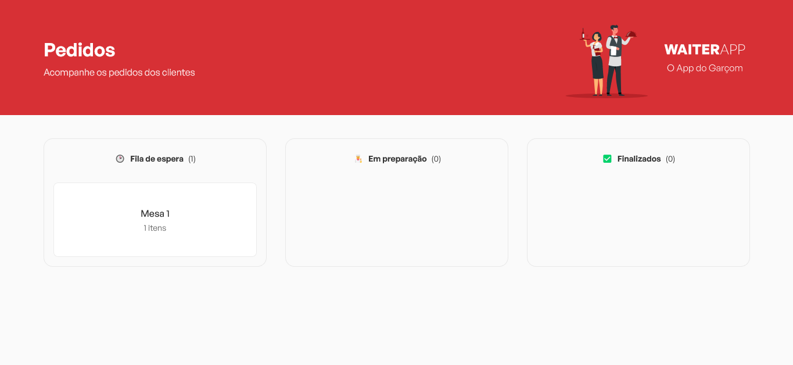
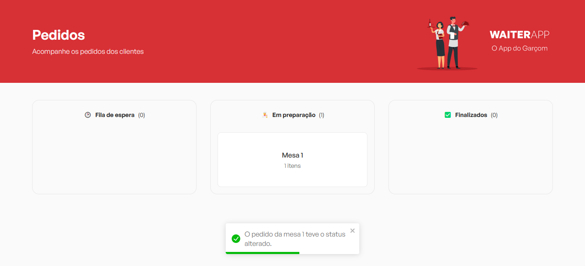
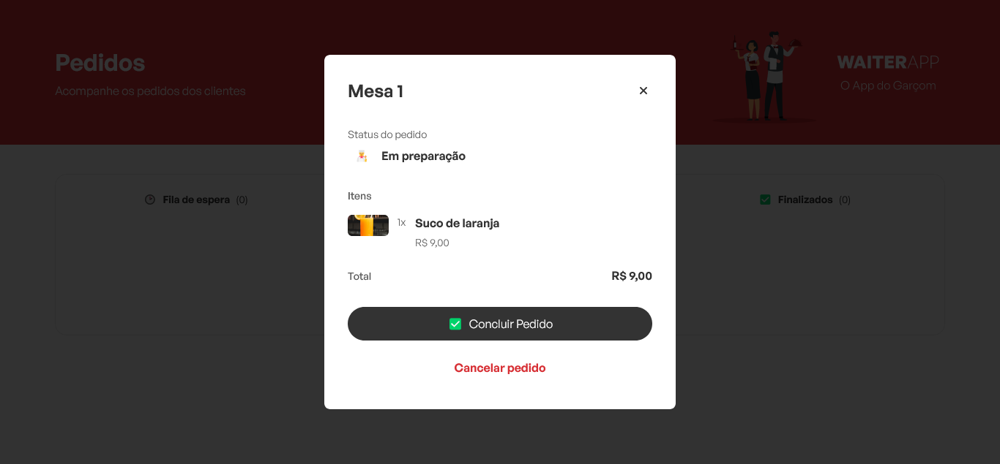
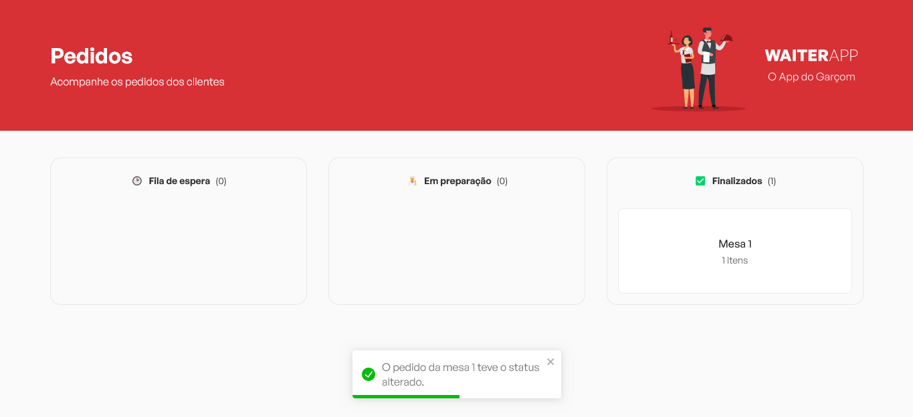
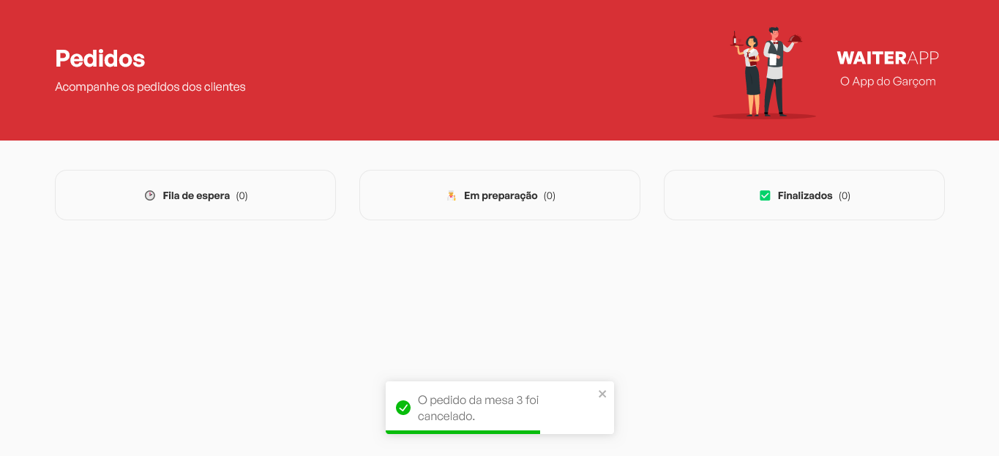

# WaiterApp

  

> Site desenvolvido em React.js que oferece aos cozinheiros uma visão dos pedidos feitos pelos clientes através da versão mobile do sistema. Graças à integração da tecnologia de WebSocket, os cozinheiros podem monitorar em tempo real os pedidos e atualizar seus status de forma eficiente, alternando entre "a fazer", "em andamento" e "concluído". Essa sincronização em tempo real otimiza a gestão dos pedidos, permitindo que a equipe de cozinha entregue um serviço ágil e de alta qualidade aos clientes

## 💻 Tecnologias utilizadas

### Ferramentas usadas durante o desenvolvimento da aplicação:

-   [Vite](https://vitejs.dev/)
-   [React.js](https://react.dev/)
-   [Typescript](https://www.typescriptlang.org/)
-   [Axios](https://axios-http.com/ptbr/docs/intro)
-   [Eslint](https://eslint.org/)
-   [styled-components](https://styled-components.com/)
-   [Socket.IO](https://socket.io/)

## 📲 Funcionalidades

### Principais funcionalidades presentes na aplicação:

-   Receber pedidos dos clientes em tempo real;
-   Ver detalhes dos pedidos;
-   Mudar status dos pedidos (Fila de espera, Em preparação, Finalizado);
-   Cancelar pedido;

## 🎨 Telas da aplicação

### A seguir, alguns prints da UI da aplicação:

 

##
